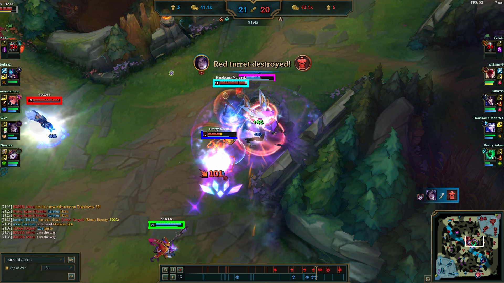

# League of Legends challenge
### 1. Competition information: 
`starter/eSportsLab_League_Challenge.pdf`

### 2. How to run script:
```bash
python lol_core.py <path_to_image>
```
eg.:
```bash
python lol_core.py starter/task_examples/screen1.jpg
```

### 3. Browse results:
You can check the results in notebook `06-RECTANGLES.ipynb` or in the `results/` directory
Each edge of rectangle corrresponds to one edge of healthbar found in the image.

